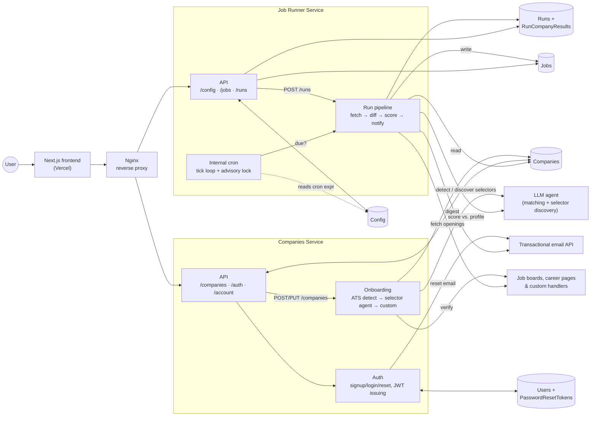

# Job Lighthouse - PRD and System Design

Job Lighthouse is an application that enables users to add and monitor chosen
companies. It also has an agent matcher in between.

**This is a ground-up rewrite.** The current system is a single Python script
(`main.py`), triggered by GitHub Actions cron, deduping in SQLite, notifying
over Gmail SMTP and Notion. Nothing on this page describes that script — it
describes the target architecture that replaces it: two Python services, a
real Postgres schema, a Next.js frontend, and real user accounts. Cutover
imports the current `config.yaml` company list; SQLite dedup history is not
migrated (see [Cutover](#cutover--data-migration)).

This doc intentionally does not slice the work into v1/v2 — it describes the
full target product. Versioning the build is a separate, later exercise.

## Core features

- Create an account (email + password, or Google) and log in
- Add companies to the pool
  - Add by job board (auto-detected)
  - Add by scraper (agent-discovered selectors, or a custom handler)
- Check all tracking companies; edit, re-test, pause, or remove one
- Define a recurrent job watcher (schedule)
- Add your PROFILE to enable agent match-making (`match_score`)
- Add keywords (include/exclude) and location to filter out irrelevant positions
- Check all jobs
  - Filter by active, company, tier
  - Sort by score
- Manage your account (change credentials, export data, delete account)

### Agentic support

Agents appear in three steps of the process:

- **ATS detection** (deterministic first): given a pasted careers URL, match
  it against known job-board signatures (Greenhouse, Lever, Ashby,
  SmartRecruiters) before ever calling an LLM
- **Selector discovery** (LLM, fallback only): when a careers URL matches no
  known board, an agent reads the page and proposes CSS selectors
- **Match scoring**: score a job against the user's PROFILE

# System design

## Services interconnection



Boxes drawn inside a service are modules in the same deploy, not separate
processes. Only two services run behind Nginx — **Auth is a module inside the
Companies Service**, not a third deploy, same reasoning as folding Config/Cron
into the Job Runner Service below.

| Component                  | Notes                                                                                                                                     |
| --------------------------- | ------------------------------------------------------------------------------------------------------------------------------------------ |
| **Nginx**                  | Single entry point on the droplet. Reverse-proxies to both services by path; terminates TLS.                                              |
| **Job Runner Config and Cron** | Owns the `Config` store and the schedule. **Not a separate deploy** — folded into the Job Runner Service, see [Scheduling](#scheduling). |
| **Job Runner Service**     | Writes `Jobs` and `Runs`/`RunCompanyResults`. Reads `Companies` and `Config`.                                                              |
| **Companies Service**      | Reads/writes `Companies`. Also owns Auth (`Users`, sessions, password resets) and account management.                                     |
| **Next.js frontend**        | Vercel-hosted. Talks to both APIs directly through Nginx — no BFF/gateway layer.                                                          |

## Datastores

1. **Config**
2. **Jobs**
3. **Companies**
4. **Runs** (+ `RunCompanyResults`) — run history, per-company breakdown, and scheduler state
5. **Users** (+ `PasswordResetTokens`) — real accounts, from v1

## Users & tenancy

**Real accounts from v1.** Unlike the original single-user plan, this rewrite
builds actual sign-up/login because the frontend and auth model need it
either way — the extra cost of a real `Users` table over a stub is small, and
it means multi-user is a config/rollout decision later, not a schema change.

- Sign up with email + password, or Google. `email_verified` is tracked but
  **not gated on** — Google sign-in bypasses it anyway, and a small early user
  base doesn't need the friction.
- Every user-owned table already carries `user_id` (`Config`, `Companies`,
  `Jobs`, `Runs`).
- Each service validates the session **JWT locally** (shared signing secret)
  — no per-request call back to the Auth module. The token carries `user_id`,
  which every existing query already filters by.
- **Multi-user data is not shared or deduped.** If two accounts track the
  same company, each gets its own `Companies` row and its own scrape.
  Accepted inefficiency for now — a shared-company-catalog optimization is a
  real architecture change, deferred until it's actually a cost problem.

## Schemas

### Users

```ts
id: string;
email: string;
password_hash: string | null; // null when the account is Google-only
google_id: string | null;
email_verified: boolean; // tracked, not enforced
created_at: Date;
```

### PasswordResetToken

```ts
id: string;
user_id: string;
token_hash: string; // never store the raw token
expires_at: Date;
used_at: Date | null;
```

Email verification has no equivalent flow in v1 — see
[Core features](#core-features) and [Auth](#auth--accounts).

### Config

```ts
id: string;
user_id: string;
keywords_include: string[];
keywords_exclude: string[]; // word-boundary matched, applied at scrape time
location: string;
cron: Cron;
profile: string; // markdown, replaces docs/PROFILE.md
profile_version: number; // bumped on every profile edit
```

`keywords_include`/`keywords_exclude` replace the single `keywords_filter`
list from the original design — the real UI (Settings → Filters) always
needed both, plus word-boundary matching on excludes so `"intern"` doesn't
exclude `"Internal Tools"`.

`profile` lives here rather than in its own store: it is 1:1 with the config,
has the same lifetime, and is read and written by exactly the same callers
(`GET /config` gives the agent everything it needs in one call). Split it out
later only if a user needs **multiple** profiles — that migration is additive.

`profile_version` increments whenever `profile` is edited. Each scored job
records the version it was matched against (`Job.profile_version`), so a stale
score is identifiable. **No history of past profile texts is kept** — only
the current text and its version number. **Editing your profile does not
trigger a rescore** of already-stored jobs — accepted staleness, same pattern
as `Job.active` below; a job's score only updates if it disappears and later
reappears.

### Job

```ts
id: string;
user_id: string;
title: string;
url: string;
location: string;
description: string;
company_id: string; // FK -> Companies.id
company: string; // denormalized display name, for rendering without a join
match_score: number;
match_description: string;
profile_version: number; // Config.profile_version at scoring time
date: Date;
notified_at: Date | null; // null = not yet included in a sent digest
active: boolean; // posting is still live — see below
```

`company_id` is the real link — the cascade, step 5's diff, and the dashboard's
company filter all key on it, so renaming a company can't orphan its jobs.
`company` is a copy of the name at scrape time, carried so `GET /jobs` renders
without a join; it may drift after a rename and is display-only.

`Job.active` means **the posting is still open**. It is not a user-dismissal flag.

- The runner flips it to `false` when a job it previously stored no longer appears
  in the company's current openings.
- Deactivating a company (`Companies.active = false`) cascades: all of that
  company's jobs are set to `active = false`.
- Reactivating a company does **not** restore its jobs. They stay `false` until
  the next run re-confirms them as open.
- Jobs are never deleted; inactive rows stay as history and are hidden from the
  dashboard's default view.

> Known conflation, accepted for now: the company cascade sets `active = false`
> on postings that may still be live. Fine while the dashboard only filters on
> this flag; revisit if "posting closed" ever needs to be a distinct signal.

**No content diffing.** If a company edits a live job's title or description
in place without changing its URL, it is never re-detected or re-scored —
same URL means same job for the lifetime of the posting. Accepted limitation;
revisit only if it causes real missed matches.

### Companies

```ts
id: string;
user_id: string;
name: string;
tier: number; // hand-set from the dashboard; no derivation
added_at: Date;
website_url: string;
active: boolean; // false = stop tracking; row and jobs are kept
source: Source;
```

### Runs

```ts
id: string;
user_id: string;
started_at: Date;
finished_at: Date | null;
status: "running" | "success" | "failed";
trigger: "cron" | "manual";
jobs_found: number;
error: string | null;
```

Earns its place three times over: it holds `last_run_at` for the scheduler, it
backs a "last run: 2h ago, 4 new jobs" panel on the dashboard, and it is where a
failed scrape becomes visible — without it a broken run is indistinguishable
from a quiet day.

### RunCompanyResult

```ts
id: string;
run_id: string; // FK -> Runs.id
company_id: string; // FK -> Companies.id
status: "ok" | "failed" | "skipped";
jobs_found: number;
error: string | null;
```

Added because the dashboard needs to say "Northstar: 0 jobs last run" and
distinguish that from "Northstar: fetch failed" — `Job` rows alone can't
encode a company that was fetched successfully and genuinely found nothing.
One row per company per run; the Companies list's per-row flag and the Runs
screen's per-company breakdown both read from here.

### Source

A company is **either** job-board-backed, scraped, or custom-handled — never
more than one. Modeled as a discriminated union on `kind` so the exclusivity
is enforced by the type.

```ts
type Source =
  | { kind: "board"; board: Board; board_id: string }
  | { kind: "scraper"; strategy: "static" | "dynamic"; selectors: Selectors }
  | { kind: "custom"; handler: string };
```

- `board_id` — the company's slug on that board (`stripe`, `kraken-technologies`).
  Needed to build the ATS API URL; often differs from `name`.
- `careers_url` lives inside `Selectors`, not on the company: only the scraper
  branch needs a jobs page. `website_url` stays the marketing site the dashboard
  links to.
- `custom` is the honest escape hatch for companies that never generalize to
  CSS selectors — `handler` names a per-company fetch function that must be
  implemented in code. Adding one of these still requires a developer to ship
  a handler; the UI can mark a company "needs custom handling" and leave it
  paused until that lands. This mirrors what the current script already does
  (bespoke `scrape_google()`, `scrape_shopify()`, etc. dispatched by a type
  string) — the schema just makes that pattern first-class instead of a
  hardcoded `if/elif` chain.

Stored as a single `jsonb` column; the union is validated in the app layer.

### Board

```ts
"lever" | "greenhouse" | "ashby" | "smartrecruiters";
```

SmartRecruiters is promoted here rather than treated as a `custom` one-off —
it has a public API like the other three, so it belongs with the real board
integrations.

### Selectors

```ts
careers_url: string; // page to load
job: string;         // job card container
title: string;
link: string;
location?: string;
```

---

## API design

| Method   | Path                          | Description                                              |
| -------- | ----------------------------- | --------------------------------------------------------- |
| `POST`   | `/auth/signup`                | create account (email+password or Google)                |
| `POST`   | `/auth/login`                 | authenticate, issue JWT                                  |
| `POST`   | `/auth/google`                | Google OAuth callback                                     |
| `POST`   | `/auth/password-reset/request`| send a password-reset email                              |
| `POST`   | `/auth/password-reset/confirm`| set a new password from a reset token                    |
| `GET`    | `/account`                    | fetch own account details                                |
| `PUT`    | `/account`                    | change credentials                                       |
| `GET`    | `/account/export`             | JSON export of all owned data                            |
| `DELETE` | `/account`                    | delete account and cascade-owned data                    |
| `GET`    | `/companies`                  | fetch all companies                                      |
| `POST`   | `/companies`                  | add new company                                          |
| `POST`   | `/companies/detect`           | given a careers URL, run ATS detection (+ fallback agent), return a draft Source and a scored sample |
| `PUT`    | `/companies/{id}`             | modify company                                           |
| `POST`   | `/companies/{id}/test`        | re-test a company's source; report reachability/count    |
| `GET`    | `/jobs`                       | fetch all jobs                                           |
| `GET`    | `/config`                     | fetch configuration                                      |
| `PUT`    | `/config`                     | modify configuration                                     |
| `POST`   | `/runs`                       | trigger a run now (manual)                               |
| `GET`    | `/runs`                       | run history for the dashboard                            |
| `GET`    | `/runs/{id}/companies`        | per-company breakdown for one run (`RunCompanyResult`)   |

---

## Services

### Job runner service

0. Acquire the advisory lock and open a `Runs` row (`status: "running"`); close
   it with `success` / `failed` when the steps below finish — see
   [Scheduling](#scheduling)
1. Get companies from DB (active only)
2. Fetch current openings for each — board API call, selector scrape, or the
   company's `custom` handler, depending on `Source.kind`
3. Get jobs from DB
4. Filter out already existing jobs (same URL = same job; see
   [Job](#job) — no content diffing)
5. Close disappeared jobs — for each company whose fetch succeeded, set
   `active = false` on stored jobs (matched by `company_id`) that are no longer
   in its current openings. **The success test differs by source kind** — see
   below. Write one `RunCompanyResult` row per company regardless of outcome.
6. Trigger agent for remaining ones
7. Write on jobs DB
8. Dispatch email — see [Notifications](#notifications)
9. ~~Invalidate cache~~ — deferred, see [Caching](#caching)

**Step 5 — what counts as a successful fetch**

A failed fetch must never be read as "all jobs closed", or one 503 from a board
empties that company's list. But an empty result is only _sometimes_ a failure
signal, so source kinds are treated differently:

| `source.kind`     | Empty result means                                            | Step 5 runs?                              |
| ------------------ | -------------------------------------------------------------- | -------------------------------------------- |
| `board`            | Genuinely zero open roles — a `200` with `[]` is unambiguous   | Yes, on any HTTP success, empty included    |
| `scraper`          | Ambiguous — could be zero roles, could be broken selectors     | Only on a **non-empty** result              |
| `custom`           | Depends on the handler; each one reports success/failure itself | Only when the handler reports success       |

Consequence, accepted: a scraped company that closes every posting keeps its
jobs `active = true` until something else changes. Preferable to silently
wiping a company's list every time a page redesign breaks its selectors. The
`RunCompanyResult` row is where that staleness would surface.

### Scheduling

**Internal cron, driven by `Config.cron`. No GitHub Actions, no external
scheduler.** This replaces the current script's GitHub Actions cron
(`daily.yml`, `full-scan.yml`) entirely — those workflows are retired at
cutover, though the same GitHub Actions setup is reused for
[deploying](#deployment) the new services. The drawn `Job Runner Config and
Cron` box is conceptual: the scheduler and the `/config` endpoints live
**inside the Job Runner Service**, not in a separate deploy.

**Tick loop:** the service wakes every minute, reads `Config.cron`, and compares
it against the last run's `started_at` (from `Runs`) to decide whether a run is
due.

Ticking, rather than registering a cron job at boot, is what keeps `Config.cron`
meaningful — `PUT /config` changes the schedule on the next tick, with no
restart and no external YAML to keep in sync.

**Overlap and duplicate protection:** before starting, take a Postgres advisory
lock (`pg_try_advisory_lock`). If it can't be acquired, a run is already in
flight and this one no-ops. One lock covers both cases:

- multiple replicas ticking at the same minute — one wins
- a manual `POST /runs` landing during a scheduled run

Release in a `finally`. Advisory locks are tied to the connection, so a crashed
process frees the lock automatically — unlike a `running` boolean column, which
would wedge until someone cleared it by hand.

**When to split the scheduler into its own service:** only if the runner needs
several replicas _and_ the schedule must survive their restarts independently.
Until then the extra deploy and HTTP hop buy nothing — and on a single
droplet, there's only ever one replica anyway.

### Caching

**Not in v1.** The original diagram's "invalidate cache" step is kept as intent,
not as a component — no cache is deployed.

Rationale: one droplet, low write volume, and `GET /jobs` is an indexed read of
a small table. There is nothing to relieve yet.

When it becomes worth adding, in likely order:

1. **Response cache on `GET /jobs`** — the dashboard polls it, the data changes
   once a day. The runner busts the key after step 7. Best value first.
2. **Scrape-result cache** — skip re-fetching a company's board if fetched
   within the last N minutes. Only matters once runs are frequent or manual
   re-runs are common.

**Where it must live:** shared, not in-process — Redis or nothing. A local cache
is only correct while exactly one replica exists; the moment the Job Runner
Service scales out, the replica that ran the job and busted its own copy is not
the replica answering the next `GET /jobs`.

### Notifications

**Email only. Notion is retired altogether** — no mirror, optional or
otherwise. The dashboard and `Jobs` store fully replace it, including as the
source of company tiers. (The current script's `notify/notion.py` integration
has no equivalent in the new design.)

**Transport: a transactional email API (Resend / Postmark / SES), called
inline from the runner and from Auth.** No queue, no worker, no outbox table.
This replaces the current script's raw Gmail SMTP — worth the swap now that
password-reset and account emails ride the same transport and need reliable
deliverability, which SMTP-through-an-app-password doesn't guarantee.

- Inline is safe for the digest because the send is the last step and jobs are
  already committed. A failed send costs one digest, never data.
- An email API rather than SMTP: no Gmail App Password to break, and SPF/DKIM
  are handled for us.

**Digest contents and the missed-send guarantee:**

- The digest is every job where `active = true AND notified_at IS NULL` — not
  "jobs inserted this run".
- **No email is sent when that set is empty.**
- `notified_at` is stamped only after the provider confirms success.

That makes missed digests self-healing: if Tuesday's send fails, Wednesday's
email contains Tuesday's _and_ Wednesday's jobs, with no retry machinery. If
sending is broken for a week, the next successful digest carries the backlog.

**Accepted failure mode:** provider returns success but the `notified_at` write
fails, so those jobs appear in the next digest too. A duplicate digest is the
right direction to fail in.

**Password-reset email** is a separate, immediate send (not batched into the
digest) — request-response, same transactional API, standard expiring-link
pattern (`PasswordResetToken.expires_at`).

### Companies service

**Flow A — read:**

1. Return all companies

**Flow B — write (manual):**

1. Receive company payload with an explicit `source`
2. Persist to DB as given — no detection involved

**Flow B' — write (agent-assisted, `POST /companies/detect`):**

1. Receive a pasted careers URL
2. **Deterministic ATS detection first** — match the URL/host against known
   signatures for Greenhouse, Lever, Ashby, SmartRecruiters. If matched: fill
   `board` + `board_id`, verify with a live fetch, done — no LLM call.
3. If no known board matches: dispatch the **LLM selector-discovery agent**
   against the page to propose `Selectors`
4. If the agent can't produce a working scrape either: surface the company as
   needing a `custom` handler — a paused, dev-blocked state, not a dead end
5. Return a draft `Source` plus a sample of matched, already-scored openings
   for the confirm screen
6. On confirm, persist `source.selectors` (or `source.board`/`board_id`)

**Flow C — auth (module):**

1. Signup — email+password (hash, store) or Google (store `google_id`)
2. Login — verify credentials, issue JWT
3. Password reset — issue token, email it, verify + rotate on confirm
4. Account — read/update credentials, export owned rows as JSON, delete
   account (cascades to `Config`, `Companies`, `Jobs`, `Runs`)

---

## Auth & accounts

**v1: hand-rolled.** Email+password (hashed) or Google sign-in, JWT sessions,
password reset via expiring token + email. No email verification gate.

**Considered for later: swap to Firebase Auth.** Deferred rather than built
now — a real hand-rolled version is simple enough at this scale and avoids an
extra paid dependency on day one; if adopted later, it replaces the `Users`
table's credential-handling internals, not the `user_id`-scoped shape of
every other table.

**Token validation:** both services check the JWT locally against a shared
signing secret — no network call to the Auth module per request. The token
carries `user_id`, which is already the join key on every table, so
authorization is just "does this row's `user_id` match the token's."

---

## Frontend

**Next.js, hosted on Vercel.** Talks to both backend APIs directly through
Nginx — no BFF layer. Screens below are the confirmed flows (from the
existing design prototype), grouped the same way:

| Flow                  | Screens                                                                                   |
| ---------------------- | -------------------------------------------------------------------------------------------- |
| 1 · Onboarding         | Sign up (email/password or Google) → Setup (empty/filled) → Jobs board, first run          |
| 2 · Configuration      | Settings tabs: Filters, Schedule, Profile, Notifications, Account                          |
| 3 · Edit a company     | Companies list → row menu (edit / re-test / pause / remove) → edit dialog → saved banner   |
| 4 · Add a company      | Companies list → paste careers URL → agent resolving → confirm (sample scored jobs) → added banner |
| 5 · Runs               | Run history: next run, today's totals, history, per-company breakdown                       |

Notable UI-driven details already folded into the schema/API above:

- Filters split into include/exclude (Config schema)
- Profile edits explicitly do **not** offer a rescore ("applies to the next
  run; already-scored jobs keep their score")
- Changing a company's tier re-groups its jobs in the UI — no schema
  implication, purely a client-side grouping key
- Row-level "0 jobs last run" / "fetch failed" flags read from
  `RunCompanyResult`

---

## Deployment

**Single DigitalOcean Droplet, Docker Compose.** Containers: Job Runner
Service, Companies Service, Postgres (self-hosted — chosen over DO's Managed
Database to cut cost; advisory locks work the same either way), and Nginx as
reverse proxy/TLS termination in front of both APIs. The Next.js frontend
deploys separately to Vercel.

**CI/CD: GitHub Actions**, building images and deploying to the droplet on
push to `main`. Reuses the CI muscle already in this repo (`daily.yml`,
`full-scan.yml`), retargeted from "run the script" to "build and ship the
services."

## Cutover / data migration

- **Company list**: one-time import of the current `config.yaml` companies
  (~40, already curated) into the new `Companies`/`Source` schema. No reason
  to lose that curation by starting from zero.
- **Dedup history**: **not migrated.** Reshaping SQLite's flat dedup rows into
  the richer `Job` schema (score, description, profile version, etc.) isn't
  worth it for what's effectively inbox history. Expect one "everything looks
  new" digest right after cutover — a one-time, accepted cost.

## References

- Claude Design UI screens: <https://claude.ai/artifact/8p1rqwg8HLSur5rfV8D1WH>
  — source of the [Frontend](#frontend) flow inventory above. Its "optional
  Notion mirror" control in Settings → Notifications is stale and should be
  removed from the prototype; Notion is retired (see
  [Notifications](#notifications)).
